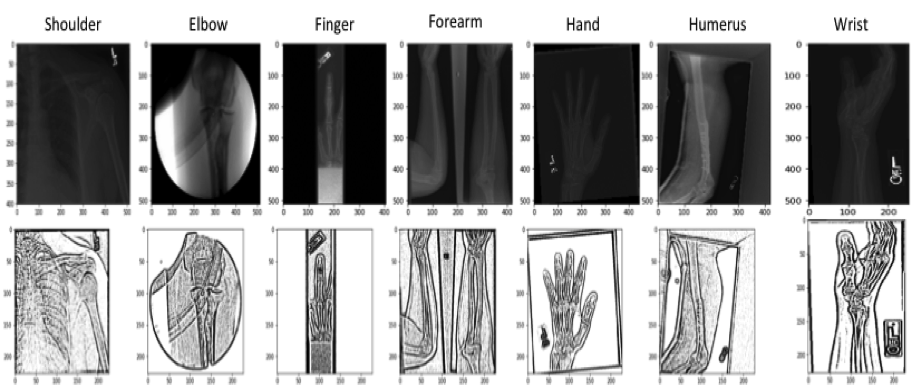
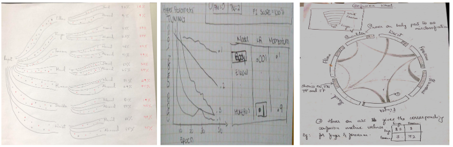
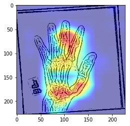
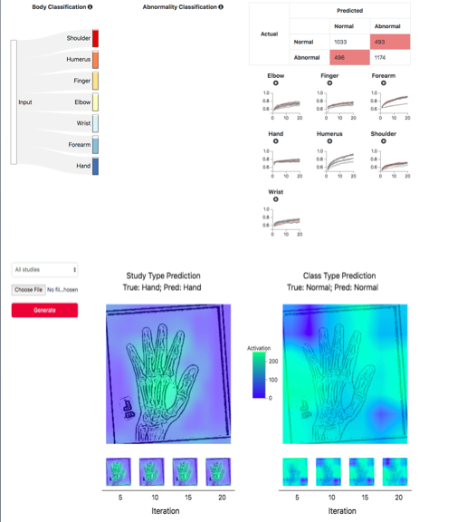
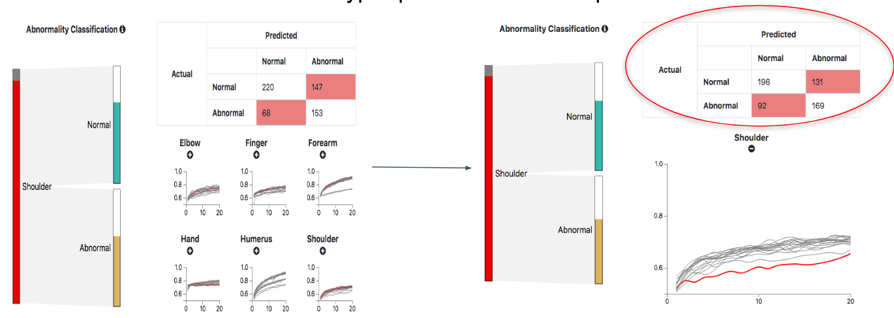
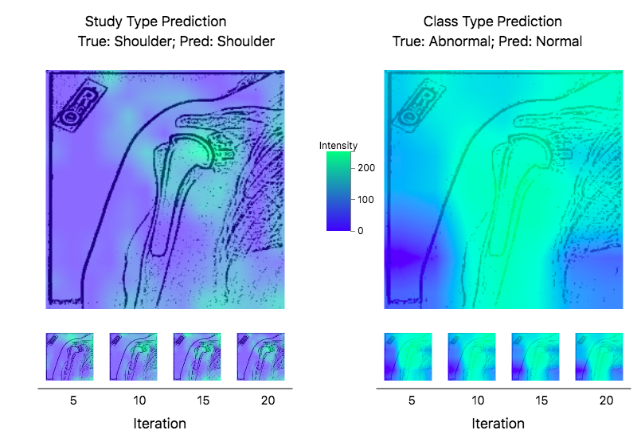
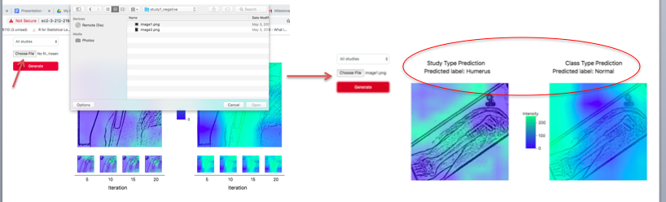

# Mura Classification Visualization Tool

## Motivation

Large high scale musculoskeletal radiographs have played a pivotal part in the intersection of machine learning and the field of medicine.  Existing research leverages radiographs as input data for various machine-learning frameworks in order to help medical practitioners detect diseases at early stages (ex. fractures, cancer, etc.). With radiographs playing a pivotal role in detecting abnormalities, it is important that the framework is sound and mimics the thought process of true radiologists. Because of the latter, we look to implement a model framework composed of multiple convolutional neural networks (CNNs), which will first diagnose the body parts and then feed another model constructed specifically for the given body part, ultimately returning the predicted label for an image. Not only do we look to constructing this model framework, but also we look to integrate it into a web application, enabling radiologist or data scientist to use. 

## Data Analysis

The dataset utilized for detecting abnormalities is the MURA dataset released by Stanford researchers and is compiled from 14,863 studies, containing 40,561 images. The original dataset is originally partitioned such that the training set contains ~90% of the data and the test set contains ~10%. Each set of data is categorized using a folder structure composed of body part, patient number, study, and image(s). In order to access all images, the paths are required; however, this is found in separate csv file, where each record represents an image. The record also includes, the abnormality label, but does not include a label for the body part. In order to extract that information, we used the path, and assigned a number for each body part. The labels range from 0 to 6, which correspond to following in the specified order: shoulder, humerus, finger, elbow, wrist, forearm, and hand.

For preprocessing, we needed to determine a set structure for the images, since the images varied in terms of channels and size. Initially, we were going to operate with 3 channels since some of the images came in as RBG and we wanted to maintain as much granular information as possible, but upon further inspection, we realized that the RBG photos had the same value per channel. Due to this, we converted everything to gray scale. Next, the CNN models used determined the width and height. Although images do not need to be a fixed size for convolutions, in order to feed a dense layer, the convolutions must result in a fixed length vector. Given our final CNN models leveraged the Alex Net and Dense Net architecture, two transformations were applied. For the Alex Net model, images were scaled to 227 x 277, and for the Dense Net model, they were scaled to 224 x 224. In all each image was represented by 51,529/50,176 quantitative variables. Next, in order to extract more information, we applied a form of object segmentation called adaptive thresholding. Adaptive thresholding is able to intensify key features of radiographs [1], which will heavily aid in detecting abnormalities. We used a mean adaptive method with a binary threshold type, assigning a max value of 255 for pixels/variables that exceeded the calculated threshold.  The pixel neighborhood used to calculate the threshold was 11 with a constant of 2. Below are examples of our preprocessing steps:

Finally, the last step required is normalization with respect to the IMAGENET dataset, which has a mean of .456 and standard deviation of .225. This is required because we will be leveraging pre-trained models and this prevents vanishing gradients in the CNN.

## Task Analysis

| “Domain” Task                                                                                   | Analytic Task(Low Level) | Search Task(Mid Level) | Analyze Task(High Level) |
|-------------------------------------------------------------------------------------------------|--------------------------|------------------------|--------------------------|
| Examine how the accuracy varies amongst body parts                                              | Compare                  | Lookup                 | Discover                 |
| Examine the effects of hyper parameters on the performance metrics                              | Compare / Summarize      | Browse                 | Discover                 |
| Observe how misclassified body parts perform in the abnormal models                             | Compare                  | Lookup                 | Discover                 |
| Observe what key features are enabling the model to classify an image’s body and abnormal class | Identify                 | Explore                | Discover                 |
| Given an x-ray image, determine if an abnormality is present                                    | Identify                 | Explore                | Annotate                 |
| Given an x-ray image, determine the body part                                                   | Identify                 | Explore                | Annotate                 |

Prior to constructing the model, we need to consider the tasks the users may require. In doing so, we will be able to generate all of the necessary information during the modeling step. We divide the type of users into two categories: data scientists and radiologist. The data scientists will be more focused on understanding how the models were constructed and different hyper parameters modified, where as the radiologist would be more concerned with the accuracy and how the model could aid them in detecting abnormalities. If we consider the tasks from a low, mid, and high level, we can see some clear differences. The data scientist would be more primarily focused on comparing performance, looking up small details, and discovering trends. The radiologist are concerned with identifying and annotating their unlabeled radiographs and detecting which aspects of the radiograph is being categorized as abnormal.

## Model Description

Image classification is a common task in the world of machine learning with the optimal approach revolving around CNNs. The CNN exploits the pixel dependency in images by utilizing filters as sliding windows and pooling the values in order to reduce the dimensionality of the problem, while maintaining the crux of the information. Although powerful, there are numerous ways to construct a CNN in regards to its architecture. Because of this, it is fairly easier to construct a poor performing model than it is to construct a successful one. In order to avoid this issue, we looked at several state-of-the-art CNNs that have proven success on the complex ImageNet dataset. The only modification necessary was in the last dense layer where the output was changed from 1,000 to 7 in order to accommodate the number of layers.

The model framework implemented is a form of an ensemble where body parts are classified first and then the abnormality. The general premise behind this approach is that each body part is generating noise for another body part, making it difficult for one model to detect all of the abnormalities. By dividing the model, up we trade off more data for specificity.  In theory, the sub-models can be considered radiologists who are specialists.  

### Body Part Classification

The first model was chosen with computational time taken into account. Currently, there are numerous state-of-the-art architectures for CNNs; however, to train each model with +30,000 images is time consuming so we trained the body part classifier on a few considering average loss and run time.  Architectures considered were Dense Net, VGG net, and Alex Net. The former produced the longest run time with each epoch taking several hours, which is the reason why it was not considered pragmatic. The performance between Alex Net and VGG Net was negligible; however, Alex Net performed exceptionally better in terms of run time per epoch.   

Prior to training, the hyper parameters needed to be tuned and an optimization algorithm needed to be chosen.  With no prior research in terms of classifying the MURA dataset into body parts, random search was employed. Random search has been proven to perform better than grid search and can achieve within 5% of the local minima using 64 trials for two hyper parameters [4]. The two hyper parameters considered were learning rate and weight decay with each being drawn geometrically from a set. Drawing geometrically from a set A and B means drawing uniformly in the log domain between log(A) and log(B), exponentiating to get a number between A and B. The set for the learning rate was .0001 and .01, while the weight decay was chosen from 3.1e-7 and 3.1e-5. Next, the two optimization algorithms considered were Adam and Stochastic Gradient descent. The latter was discarded after 16 trials, as all of the results were significantly less promising than all of the Adam results. Below are the top 5 trials:

| Trial | Optimization Algorithm | Learning Rate | Weight Decay | Average Loss | Accuracy |
|-------|------------------------|---------------|--------------|--------------|----------|
| 3     | Adam                   | 0.0013        | 1.02E-06     | 1.06         | 66.97%   |
| 46    | Adam                   | 0.0019        | 8.22E-07     | 1.10         | 65.66%   |
| 63    | Adam                   | 0.0012        | 2.74E-05     | 1.07         | 65.56%   |
| 22    | Adam                   | 0.0009        | 4.69E-07     | 1.16         | 62.79%   |
| 60    | Adam                   | 0.0014        | 2.13E-05     | 1.18         | 61.72%   |

Based on the results, the top performing hyper parameters were used. The model was trained for 30 epochs with each epoch iterating over the entire training set with a batch size of 1,024. Since this a multi-task problem, a cross entropy loss function was used. The final results for both the training set and test set is below:
  
|          |Shoulder | Humerus| Finger | Elbow  | Wrist   | Forearm| Hand   |
|----------|---------|--------|--------|--------|---------|--------|--------|
| **Shoulder** | 99.29%  | 0.18%  | 0.00%  | 0.36%  | 0.00%   | 0.18%  | 0.00%  |
| **Humerus**  | 5.21%   | 80.90% | 1.39%  | 5.21%  | 0.69%   | 6.25%  | 0.35%  |
| **Finger**   | 0.22%   | 0.43%  | 93.28% | 0.22%  | 1.30%   | 0.43%  | 4.12%  |
| **Elbow**    | 1.94%   | 0.43%  | 0.22%  | 94.19% | 1.94%   | 1.29%  | 0.00%  |
| **Wrist**    | 0.46%   | 0.15%  | 1.37%  | 0.30%  | 95.29%  | 1.37%  | 1.06%  |
| **Forearm**  | 0.00%   | 5.65%  | 1.99%  | 9.30%  | 6.31%   | 76.74% | 0.00%  |
| **Hand**     | 0.22%   | 0.00%  | 0.43%  | 0.00%  | 1.52%   | 0.43%  | 97.39% |

### Abnormality Detection

The abnormality detection model implemented is a 169 hidden layer network, as existing research has proven it’s the optimal architecture for the task [3]. Other architectures were initially attempted, but the models such as Alex Net and VGG Net did not learn, consistently revolving around ~50%. 

The approach for hyper parameter tuning follows the same as the previous model. In this case, we did not consider stochastic gradient descent, as the leading model employs Adam using the same architecture [3] . Another difference from the other model is that all models were maintained such that none were discarded.  There were 16 trials for 7 body parts, resulting in 112 models. We maintained all models so that a user could see how the different hyper parameter sets influence the test information. Below are the top performing abnormality detection models per body part:
 
|					    | Sensitivity( TP Rate) | Specificity (TN Rate) |
|-----------------------|-----------------------|--------|
| **Shoulder**              | 79.33%                | 54.17% |
| **Humerus**               | 68.18%                | 79.84% |
| **Finger**                | 78.05%                | 59.92% |
| **Elbow**                | 71.76%                | 59.31% |
| **Wrist**                 | 68.87%                | 74.92% |
| **Forearm**               | 77.10%                | 61.59% |
| **Hand**                  | 74.02%                | 56.19% |
| **Total**                 | **73.79%**               | **63.05%**|

 
## Design Process
In terms of how to integrate this framework with a web application, we began with three preliminary sketches: a particle visualization, a hyper parameter tuning line chart, and a confusion wheel. 

The latter was eliminated immediately following initial project feedback, as although it was aesthetically appealing, the information was not conveyed in a straightforward manner. One of the key points introduced in the course is not to over-complicate simple information. Heeding this feedback, we incorporated the more traditional confusion matrix categorizing the records into  True Positive, True Negative, False Positive, or False Negative. In terms of this experiment, positive refers to abnormal. 

Also based on the removal of the confusion wheel, we needed to incorporate another visualization that can capture the essence of the model. We needed a method that made the CNN models not black boxes. Because of this we introduced the gradient class activation mapping. The preliminary implementation is below:

The heat map illustrated was intended to show which parts of the image are helping to determine the current classification, whether its body part or abnormality. Unfortunately, the above still needed to be tuned. Even though traditional heat maps use the color scheme as presented above, it is not recommended, as continuous variables should be encoded using the color saturation and luminance channel rather than color HUE. Also, this needed to be coupled with the model interaction. This way the user understands why their image is being classified as is. 

The particle visualization had a few minor issues that needed to be addressed as well. Initially, each image was going to be represented by a point mark; however, this created a great amount of occlusion and hindered the performance of the visualization such that run time was long. In order to remediate this problem, we made it so that every 10 images were encoded using the point mark. Next, we needed to allow a user to visualize the distribution of the initial results from the body part classifier without creating too much cluster. This was best presented as a stacked bar chart, where the user could interact and explore the bar charts further, yet during usability testing it was suggested clicking on the bars was not intuitive. This was simple to fix such that we added a tool tip to let the users know they can gain further granular information by clicking on various visualizations. 

Next, the hyper parameter chart needed to modified such that it needed a large amount of space to fix the occlusion amongst the lines; however,  by just increasing the graph, we are not utilizing our space efficiently. To fix this we enabled the users to increase the size if they chose to explore those certain hyper parameters. Also, since we used random search it didn't make sense for uses to toggle between hyper parameters rather this information could be shown via hovering. 

Finally, after receiving all of the feedback, we made sure our visualizations linked and that enough information was given to the user. We provided sufficient information such that the user understands what he is given, but also made the visualization simple enough that is intuitive to operate

## Final Visualization

The final visualization is depicted below:

The user is able to clearly see a summary of the total results - using the best models - in the confusion matrix. With every point mark representing 10 images, we encode their true body part label using the hue color channel. This hue color channel is also evident in the stacked bar charts, which shows images classified correctly and those that are not. To encode their predicted body part label, we use the spatial position and motion channel. By doing so, we have utilized the top three methods for encoding categorical variables. To encode the precision we use the line mark and length channel. The longer the line, the more precise the body part classification is. We then incorporate interactivity such that the stacked bar chart can be clicked on to explore the misclassification distribution further. By exploring each body part specifically, we enable the confusion matrix to be updated. 

The final linked visualizations are the hyper parameter tuning charts, which enable the user to modify any of the abnormality detection models. A given set of hyper parameters can be considered λ such that each λ is composed of a learning rate and weight decay. The line chart was chosen because we are encoding two continuous variables. This enables the user to see a trend. Also, for discriminability purposes we highlight the active hyper parameter model as red which immediately is drawn to the eye.

Finally, to understand more about how the Neural network learns about these images, we have implemented Grad Cam.

Gradient-weighted Class Activation Mapping (Grad-CAM), uses the gradients of any target concept, flowing into the final convolutional layer to produce a coarse localization map highlighting the important regions in the image for predicting the concept. Since it is continuous, we encoded the intensity using saturation and luminance. The epochs were encoded using the horizontal spatial position such that it is clear to the user that the images should be improving over time. 

Finally, we incorporated a means of interacting with the user. They can load any image, and have our models run on it. They will be able to see the class assignment and the reason why the class was assigned.

### Packages Used

flask

flask-restful

flask-cors

pandas

sklearn

torchvision

user requests

libSM 

libXrender 

libXext

## Conclusion

The visualization tool has been smoothly integrated with our models, conveying all information required to address the tasks defined. Our visualization clear depicts the flow of our model and its results. We also incorporate a means of shedding light on how the model operates. Unforunately, there is room for improvement regarding accuracy. If given more time, we would be able to run for my epochs instead of just 20. Also, due to processing limiations we had to limit our batch size. If increased, we strongly believe it would have performed better. From a visualization standpoint, we could add an option for the user to choose a color map for the GradCAM heatmaps. This option would aid users who are visually impaired with some sort of color blindness. Overall, our tool is effective but could even be better. All design choices have leveraged course material, including marks, channels, linking, and hovering.

The application is hosted at: http://ec2-3-212-216-62.compute-1.amazonaws.com/

Video demonstration of the tool: https://youtu.be/JmPMNZbUzUs
